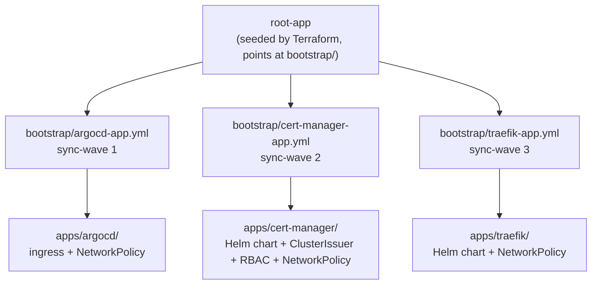

[← Back to README](../README.md) · [Getting started](getting-started.md) · [Operations](operations.md) · [Security model](security.md)

# Architecture

## The app-of-apps pattern

Nothing in this repo is ever applied by hand. ArgoCD is seeded — by Terraform, in `sre-homelab` — with exactly one `Application`, `root-app`, pointed at this repo's `bootstrap/` directory:



Every file in `bootstrap/` is itself an ArgoCD `Application` pointed at one directory under `apps/`. Adding a new app to the cluster means two things: a new `apps/<name>/` directory, and a new `bootstrap/<name>-app.yml` pointing at it. Nothing else registers an app with ArgoCD.

## Sync waves, and why this order

`argocd.argoproj.io/sync-wave` on each file in `bootstrap/` controls apply order — ArgoCD syncs lower waves first and waits for them to be healthy before starting the next:

| Wave | App | Why it has to go here |
|---|---|---|
| 1 | `apps/argocd` | Adds an Ingress and a NetworkPolicy to the already-running ArgoCD instance (see below) |
| 2 | `apps/cert-manager` | Installs the CRDs and the `ClusterIssuer` that everything after this needs for TLS |
| 3 | `apps/traefik` | The ingress controller — needs `cert-manager` to already exist so its own Ingress can request a certificate |

Getting this order wrong is a real failure mode, not a theoretical one: earlier in this project's history, `apps/traefik` referenced a resource whose CRD didn't exist, and ArgoCD rejected the *entire* Application — including the Helm chart that installs Traefik itself — leaving the cluster with no ingress controller at all. Ordering constraints in a GitOps repo aren't just aesthetic; a single bad resource in a wave can take out everything else in it.

## The one asymmetry worth knowing

`apps/argocd/kustomization.yml` has no `namespace.yml` and installs no Helm chart. That's deliberate, not an oversight: ArgoCD itself is already running by the time this repo's Applications sync — it's installed via a `HelmChart` custom resource that Terraform seeds directly into k3s's manifest directory at first boot, before GitOps takes over at all. `apps/argocd` only adds an `Ingress` and a `NetworkPolicy` on top of an instance that already exists. If you're looking for where ArgoCD gets installed, it isn't in this repo — see [`sre-homelab`'s bootstrap chain](https://github.com/sbhiii/sre-homelab/blob/main/docs/architecture.md#the-bootstrap-chain).

## Kustomize + Helm

Every app that pulls an upstream chart uses Kustomize's `helmCharts:` field with `valuesInline`, rather than a separate `HelmRelease` or Helm-native workflow:

```yaml
helmCharts:
  - name: cert-manager
    releaseName: cert-manager
    version: v1.19.4
    repo: https://charts.jetstack.io
    valuesInline:
      installCRDs: true
```

This requires `--enable-helm`, which is set cluster-wide on ArgoCD's own `kustomize.buildOptions` (again, seeded by Terraform in the other repo), so ArgoCD's repo-server renders it automatically. Validating a change **locally**, before pushing, needs the same flag passed explicitly:

```bash
kubectl kustomize --enable-helm apps/cert-manager
```

Chart versions are pinned inline in each `kustomization.yml` — that's the only place to bump them. Currently: `cert-manager` `v1.19.4`, `traefik` `39.0.2`.

## Ingress conventions

Traefik runs as a `Deployment` with `hostPort: 80/443` and a `ClusterIP` Service — there's no `LoadBalancer`, since `servicelb` is disabled on the k3s side and there's no Hetzner load balancer in front of it. Every exposed app uses a plain `Ingress`, not an `IngressRoute`, with the same annotation set:

```yaml
cert-manager.io/cluster-issuer: "letsencrypt-route53"
traefik.ingress.kubernetes.io/router.tls: "true"
traefik.ingress.kubernetes.io/router.entrypoints: websecure
```

Hostnames live under `*.homelab.sbhi.io` — a wildcard DNS record in the infrastructure repo's Terraform points them all at the node, so a new `Ingress` here needs no matching DNS change there. `cert-manager` obtains a certificate for each hostname automatically via the `ClusterIssuer` referenced in that first annotation; see [Getting started](getting-started.md) for the values that `ClusterIssuer` needs from the other repo, and [`sre-homelab`'s architecture doc](https://github.com/sbhiii/sre-homelab/blob/main/docs/architecture.md#the-oidc-trust-chain) for how it authenticates to Route53 without holding a credential.

## Repository layout

```
bootstrap/
  argocd-app.yml        sync-wave 1 -> apps/argocd
  cert-manager-app.yml  sync-wave 2 -> apps/cert-manager
  traefik-app.yml       sync-wave 3 -> apps/traefik

apps/
  argocd/
    ingress.yml          ArgoCD's own web UI, TLS via cert-manager
    networkpolicy.yml     denies egress to the Hetzner metadata service
    kustomization.yml

  cert-manager/
    namespace.yml
    cluster-issuer.yml    the Route53 DNS-01 solver, OIDC-authenticated
    networkpolicy.yml
    kustomization.yml      pulls the jetstack/cert-manager chart, projects the
                           STS token and sets AWS_ROLE_ARN

  traefik/
    namespace.yml
    networkpolicy.yml
    kustomization.yml      pulls the traefik/traefik chart; API and dashboard
                           not served, HTTP redirected to HTTPS
```

---

[← Back to README](../README.md) · [Getting started →](getting-started.md)
